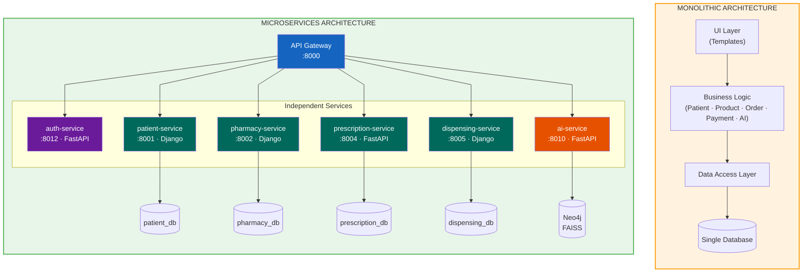

# Hình: mono_vs_micro
# Dán code dưới vào https://mermaid.live để xuất ảnh PNG

```mermaid
%%{init: {"flowchart": {"curve": "linear"}}}%%
graph TB
    subgraph MONO["MONOLITHIC ARCHITECTURE"]
        direction TB
        M_UI["UI Layer\n(Templates)"]
        M_BL["Business Logic\n(Patient · Product · Order · Payment · AI)"]
        M_DA["Data Access Layer"]
        M_DB[("Single Database")]

        M_UI --> M_BL --> M_DA --> M_DB
    end

    subgraph MICRO["MICROSERVICES ARCHITECTURE"]
        direction TB
        GW["API Gateway\n:8000"]

        subgraph SERVICES["Independent Services"]
            direction LR
            AUTH["auth-service\n:8012 · FastAPI"]
            PAT["patient-service\n:8001 · Django"]
            PHAR["pharmacy-service\n:8002 · Django"]
            PRESC["prescription-service\n:8004 · FastAPI"]
            DISP["dispensing-service\n:8005 · Django"]
            AI["ai-service\n:8010 · FastAPI"]
        end

        DB1[("patient_db")]
        DB2[("pharmacy_db")]
        DB3[("prescription_db")]
        DB4[("dispensing_db")]
        DB5[("Neo4j\nFAISS")]

        GW --> AUTH & PAT & PHAR & PRESC & DISP & AI
        PAT --> DB1
        PHAR --> DB2
        PRESC --> DB3
        DISP --> DB4
        AI --> DB5
    end

    style MONO fill:#fff3e0,stroke:#ff9800,stroke-width:2px
    style MICRO fill:#e8f5e9,stroke:#4caf50,stroke-width:2px
    style GW fill:#1565c0,color:#fff
    style AUTH fill:#6a1b9a,color:#fff
    style PAT fill:#00695c,color:#fff
    style PHAR fill:#00695c,color:#fff
    style PRESC fill:#00695c,color:#fff
    style DISP fill:#00695c,color:#fff
    style AI fill:#e65100,color:#fff
```
