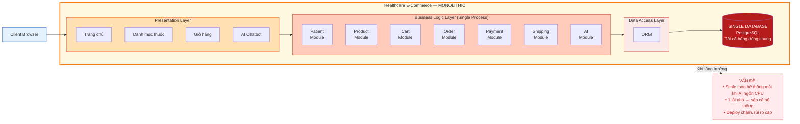

# Hình: healthcare_monolithic
# Dán code dưới vào https://mermaid.live để xuất ảnh PNG

```mermaid
%%{init: {"flowchart": {"curve": "linear"}}}%%
graph LR
    CLIENT["Client Browser"]

    subgraph MONOLITH["Healthcare E-Commerce — MONOLITHIC"]
        direction LR

        subgraph UI["Presentation Layer"]
            direction TB
            P1["Trang chủ"]
            P2["Danh mục thuốc"]
            P3["Giỏ hàng"]
            P4["AI Chatbot"]
        end

        subgraph BL["Business Logic Layer (Single Process)"]
            direction TB
            B1["Patient\nModule"]
            B2["Product\nModule"]
            B3["Cart\nModule"]
            B4["Order\nModule"]
            B5["Payment\nModule"]
            B6["Shipping\nModule"]
            B7["AI\nModule"]
        end

        subgraph DAL["Data Access Layer"]
            D1["ORM"]
        end

        DB[("SINGLE DATABASE\nPostgreSQL\nTất cả bảng dùng chung")]
    end

    PROBLEM["VẤN ĐỀ:\n• Scale toàn hệ thống mỗi khi AI ngốn CPU\n• 1 lỗi nhỏ → sập cả hệ thống\n• Deploy chậm, rủi ro cao"]

    CLIENT --> UI
    UI --> BL
    BL --> DAL --> DB
    MONOLITH -.->|"Khi tăng trưởng"| PROBLEM

    style MONOLITH fill:#fff8e1,stroke:#f57f17,stroke-width:3px
    style UI fill:#ffe0b2,stroke:#e65100
    style BL fill:#ffccbc,stroke:#bf360c
    style DAL fill:#fbe9e7,stroke:#bf360c
    style DB fill:#b71c1c,color:#fff
    style PROBLEM fill:#ffebee,stroke:#c62828,color:#c62828
    style CLIENT fill:#e3f2fd,stroke:#1565c0
```
