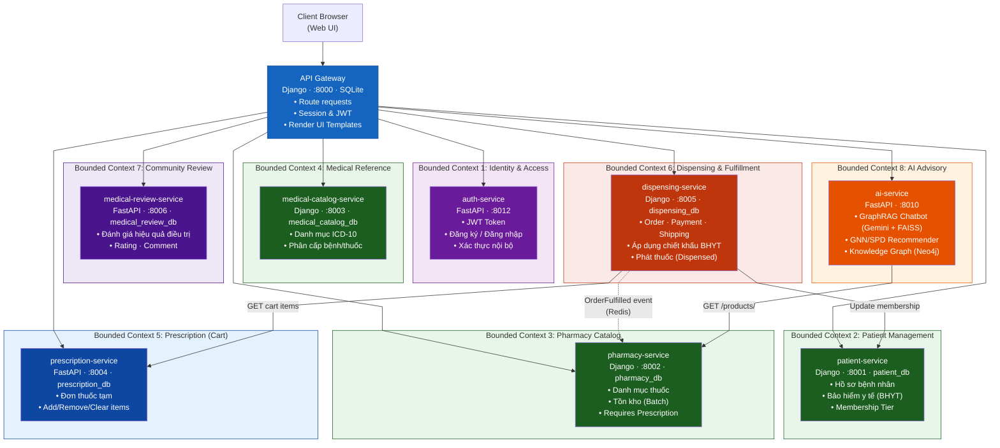

# Hình: healthcare_decomposition
# DDD Decomposition — 8 Bounded Contexts → 8 Microservices
# Dán code dưới vào https://mermaid.live để xuất ảnh PNG

```mermaid
%%{init: {"flowchart": {"curve": "linear"}}}%%
graph TB
    CLIENT["Client Browser\n(Web UI)"]

    GW["API Gateway\nDjango · :8000 · SQLite\n• Route requests\n• Session & JWT\n• Render UI Templates"]

    subgraph BC1["Bounded Context 1: Identity & Access"]
        AUTH["auth-service\nFastAPI · :8012\n• JWT Token\n• Đăng ký / Đăng nhập\n• Xác thực nội bộ"]
    end

    subgraph BC2["Bounded Context 2: Patient Management"]
        PAT["patient-service\nDjango · :8001 · patient_db\n• Hồ sơ bệnh nhân\n• Bảo hiểm y tế (BHYT)\n• Membership Tier"]
    end

    subgraph BC3["Bounded Context 3: Pharmacy Catalog"]
        PHAR["pharmacy-service\nDjango · :8002 · pharmacy_db\n• Danh mục thuốc\n• Tồn kho (Batch)\n• Requires Prescription"]
    end

    subgraph BC4["Bounded Context 4: Medical Reference"]
        CAT["medical-catalog-service\nDjango · :8003 · medical_catalog_db\n• Danh mục ICD-10\n• Phân cấp bệnh/thuốc"]
    end

    subgraph BC5["Bounded Context 5: Prescription (Cart)"]
        PRESC["prescription-service\nFastAPI · :8004 · prescription_db\n• Đơn thuốc tạm\n• Add/Remove/Clear items"]
    end

    subgraph BC6["Bounded Context 6: Dispensing & Fulfillment"]
        DISP["dispensing-service\nDjango · :8005 · dispensing_db\n• Order · Payment · Shipping\n• Áp dụng chiết khấu BHYT\n• Phát thuốc (Dispensed)"]
    end

    subgraph BC7["Bounded Context 7: Community Review"]
        REV["medical-review-service\nFastAPI · :8006 · medical_review_db\n• Đánh giá hiệu quả điều trị\n• Rating · Comment"]
    end

    subgraph BC8["Bounded Context 8: AI Advisory"]
        AI["ai-service\nFastAPI · :8010\n• GraphRAG Chatbot (Gemini + FAISS)\n• GNN/SPD Recommender\n• Knowledge Graph (Neo4j)"]
    end

    CLIENT --> GW
    GW --> AUTH & PAT & PHAR & CAT & PRESC & DISP & REV & AI

    DISP -->|"GET cart items"| PRESC
    DISP -->|"Update membership"| PAT
    DISP -.->|"OrderFulfilled event\n(Redis)"| PHAR

    AI -->|"GET /products/"| PHAR

    style GW fill:#1565c0,color:#fff,stroke:#0d47a1
    style AUTH fill:#6a1b9a,color:#fff
    style PAT fill:#1b5e20,color:#fff
    style PHAR fill:#1b5e20,color:#fff
    style CAT fill:#1b5e20,color:#fff
    style PRESC fill:#0d47a1,color:#fff
    style DISP fill:#bf360c,color:#fff
    style REV fill:#4a148c,color:#fff
    style AI fill:#e65100,color:#fff
    style BC1 fill:#f3e5f5,stroke:#6a1b9a
    style BC2 fill:#e8f5e9,stroke:#1b5e20
    style BC3 fill:#e8f5e9,stroke:#1b5e20
    style BC4 fill:#e8f5e9,stroke:#1b5e20
    style BC5 fill:#e3f2fd,stroke:#0d47a1
    style BC6 fill:#fbe9e7,stroke:#bf360c
    style BC7 fill:#ede7f6,stroke:#4a148c
    style BC8 fill:#fff3e0,stroke:#e65100
```
