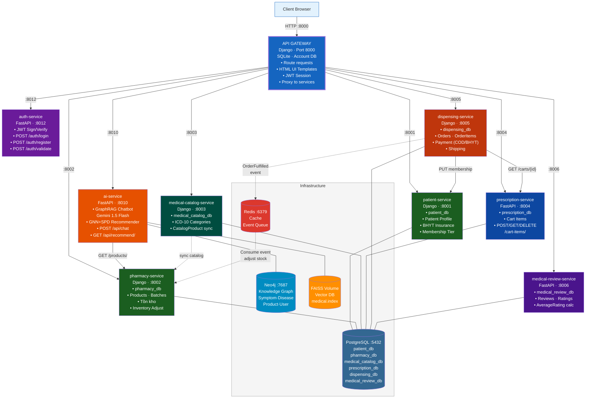

# Hình: microservice
# Kiến trúc tổng thể Microservices — Health-Micro-AI
# Dán code dưới vào https://mermaid.live để xuất ảnh PNG

```mermaid
%%{init: {"flowchart": {"curve": "linear"}}}%%
graph TB
    CLIENT["Client Browser"]

    GW["API GATEWAY\nDjango · Port 8000\nSQLite · Account DB\n• Route requests\n• HTML UI Templates\n• JWT Session\n• Proxy to services"]

    subgraph INFRA["Infrastructure"]
        PG[("PostgreSQL :5432\npatient_db\npharmacy_db\nmedical_catalog_db\nprescription_db\ndispensing_db\nmedical_review_db")]
        NEO[("Neo4j :7687\nKnowledge Graph\nSymptom·Disease\nProduct·User")]
        REDIS[("Redis :6379\nCache\nEvent Queue")]
        FAISS[("FAISS Volume\nVector DB\nmedical.index")]
    end

    AUTH["auth-service\nFastAPI · :8012\n• JWT Sign/Verify\n• POST /auth/login\n• POST /auth/register\n• POST /auth/validate"]

    PAT["patient-service\nDjango · :8001\n• patient_db\n• Patient Profile\n• BHYT Insurance\n• Membership Tier"]

    PHAR["pharmacy-service\nDjango · :8002\n• pharmacy_db\n• Products · Batches\n• Tồn kho\n• Inventory Adjust"]

    CAT["medical-catalog-service\nDjango · :8003\n• medical_catalog_db\n• ICD-10 Categories\n• CatalogProduct sync"]

    PRESC["prescription-service\nFastAPI · :8004\n• prescription_db\n• Cart Items\n• POST/GET/DELETE\n  /cart-items/"]

    DISP["dispensing-service\nDjango · :8005\n• dispensing_db\n• Orders · OrderItems\n• Payment (COD/BHYT)\n• Shipping"]

    REV["medical-review-service\nFastAPI · :8006\n• medical_review_db\n• Reviews · Ratings\n• AverageRating calc"]

    AI["ai-service\nFastAPI · :8010\n• GraphRAG Chatbot\n  Gemini 1.5 Flash\n• GNN+SPD Recommender\n• POST /api/chat\n• GET /api/recommend/"]

    CLIENT -->|"HTTP :8000"| GW

    GW -->|":8012"| AUTH
    GW -->|":8001"| PAT
    GW -->|":8002"| PHAR
    GW -->|":8003"| CAT
    GW -->|":8004"| PRESC
    GW -->|":8005"| DISP
    GW -->|":8006"| REV
    GW -->|":8010"| AI

    DISP -->|"GET /carts/{id}"| PRESC
    DISP -->|"PUT membership"| PAT
    DISP -.->|"OrderFulfilled\nevent"| REDIS
    REDIS -.->|"Consume event\nadjust stock"| PHAR

    AI -->|"GET /products/"| PHAR
    CAT -.->|"sync catalog"| PHAR

    PAT --- PG
    PHAR --- PG
    CAT --- PG
    PRESC --- PG
    DISP --- PG
    REV --- PG

    AI --- NEO
    AI --- FAISS

    style CLIENT fill:#e3f2fd,stroke:#1565c0
    style GW fill:#1565c0,color:#fff,stroke-width:3px
    style AUTH fill:#6a1b9a,color:#fff
    style PAT fill:#1b5e20,color:#fff
    style PHAR fill:#1b5e20,color:#fff
    style CAT fill:#004d40,color:#fff
    style PRESC fill:#0d47a1,color:#fff
    style DISP fill:#bf360c,color:#fff
    style REV fill:#4a148c,color:#fff
    style AI fill:#e65100,color:#fff
    style INFRA fill:#f5f5f5,stroke:#9e9e9e
    style PG fill:#336791,color:#fff
    style NEO fill:#008cc1,color:#fff
    style REDIS fill:#dc382d,color:#fff
    style FAISS fill:#ff8f00,color:#fff
```
