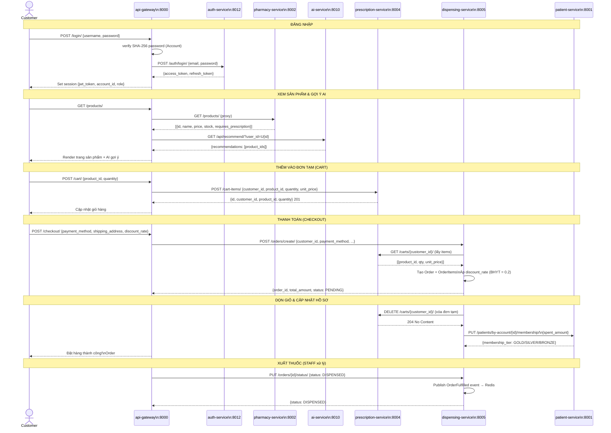

# Hình: sequence_order
# Sequence Diagram — Luồng Mua Thuốc End-to-End
# Dán code dưới vào https://mermaid.live để xuất ảnh PNG

```mermaid
sequenceDiagram
    actor CUS as  Customer
    participant GW as  api-gateway\n:8000
    participant AUTH as  auth-service\n:8012
    participant PHAR as  pharmacy-service\n:8002
    participant AI as  ai-service\n:8010
    participant PRESC as  prescription-service\n:8004
    participant DISP as  dispensing-service\n:8005
    participant PAT as  patient-service\n:8001

    Note over CUS,PAT:  ĐĂNG NHẬP
    CUS->>GW: POST /login/ {username, password}
    GW->>GW: verify SHA-256 password (Account)
    GW->>AUTH: POST /auth/login/ {email, password}
    AUTH-->>GW: {access_token, refresh_token}
    GW-->>CUS: Set session {jwt_token, account_id, role}

    Note over CUS,PAT:  XEM SẢN PHẨM & GỢI Ý AI
    CUS->>GW: GET /products/
    GW->>PHAR: GET /products/ (proxy)
    PHAR-->>GW: [{id, name, price, stock, requires_prescription}]
    GW->>AI: GET /api/recommend/?user_id=U{id}
    AI-->>GW: {recommendations: [product_ids]}
    GW-->>CUS: Render trang sản phẩm + AI gợi ý

    Note over CUS,PAT:  THÊM VÀO ĐƠN TẠM (CART)
    CUS->>GW: POST /cart/ {product_id, quantity}
    GW->>PRESC: POST /cart-items/ {customer_id, product_id, quantity, unit_price}
    PRESC-->>GW: {id, customer_id, product_id, quantity} 201
    GW-->>CUS: Cập nhật giỏ hàng

    Note over CUS,PAT:  THANH TOÁN (CHECKOUT)
    CUS->>GW: POST /checkout/ {payment_method, shipping_address, discount_rate}
    GW->>DISP: POST /orders/create/ {customer_id, payment_method, ...}
    DISP->>PRESC: GET /carts/{customer_id}/ (lấy items)
    PRESC-->>DISP: [{product_id, qty, unit_price}]
    DISP->>DISP: Tạo Order + OrderItems\nÁp discount_rate (BHYT = 0.2)
    DISP-->>GW: {order_id, total_amount, status: PENDING}

    Note over CUS,PAT:  DỌN GIỎ & CẬP NHẬT HỒ SƠ
    DISP->>PRESC: DELETE /carts/{customer_id}/ (xóa đơn tạm)
    PRESC-->>DISP: 204 No Content
    DISP->>PAT: PUT /patients/by-account/{id}/membership/\n{spent_amount}
    PAT-->>DISP: {membership_tier: GOLD/SILVER/BRONZE}

    GW-->>CUS:  Đặt hàng thành công!\nOrder #{order_id} - {total_amount}₫

    Note over CUS,PAT:  XUẤT THUỐC (STAFF xử lý)
    GW->>DISP: PUT /orders/{id}/status/ {status: DISPENSED}
    DISP->>DISP: Publish OrderFulfilled event → Redis
    DISP-->>GW: {status: DISPENSED}
```
