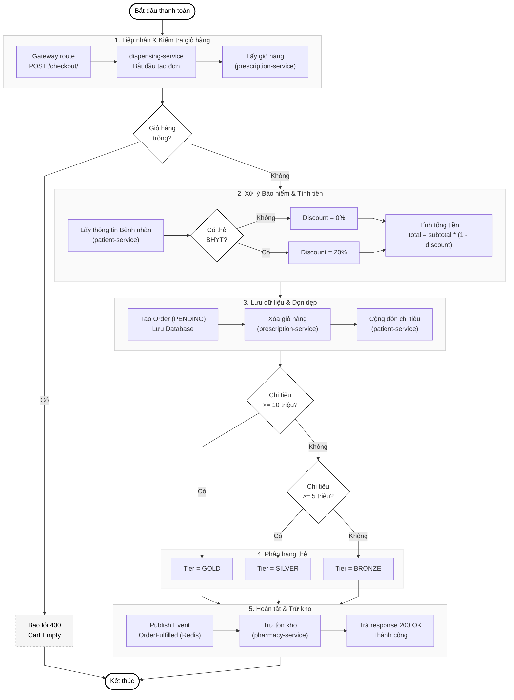

# Hình: activity_order
# Activity Diagram — Quy trình Thanh toán trong dispensing-service
# Dán code dưới vào https://mermaid.live để xuất ảnh PNG

```mermaid
%%{init: {"flowchart": {"curve": "linear", "nodeSpacing": 30, "rankSpacing": 40}}}%%
flowchart TD
    START(["Bắt đầu thanh toán"])

    subgraph G1 ["1. Tiếp nhận & Kiểm tra giỏ hàng"]
        direction LR
        A["Gateway route\nPOST /checkout/"] --> B["dispensing-service\nBắt đầu tạo đơn"]
        B --> C["Lấy giỏ hàng\n(prescription-service)"]
    end

    D{"Giỏ hàng\ntrống?"}
    E["Báo lỗi 400\nCart Empty"]

    subgraph G2 ["2. Xử lý Bảo hiểm & Tính tiền"]
        direction LR
        F["Lấy thông tin Bệnh nhân\n(patient-service)"] --> G{"Có thẻ\nBHYT?"}
        G -- Không --> H["Discount = 0%"]
        G -- Có --> I["Discount = 20%"]
        H --> J["Tính tổng tiền\ntotal = subtotal * (1 - discount)"]
        I --> J
    end

    subgraph G3 ["3. Lưu dữ liệu & Dọn dẹp"]
        direction LR
        K["Tạo Order (PENDING)\nLưu Database"] --> L["Xóa giỏ hàng\n(prescription-service)"]
        L --> M["Cộng dồn chi tiêu\n(patient-service)"]
    end

    N{"Chi tiêu\n>= 10 triệu?"}
    O{"Chi tiêu\n>= 5 triệu?"}
    
    subgraph G4 ["4. Phân hạng thẻ"]
        direction LR
        P["Tier = GOLD"]
        Q["Tier = SILVER"]
        R["Tier = BRONZE"]
    end

    subgraph G5 ["5. Hoàn tất & Trừ kho"]
        direction LR
        S["Publish Event\nOrderFulfilled (Redis)"] --> T["Trừ tồn kho\n(pharmacy-service)"]
        T --> U["Trả response 200 OK\nThành công"]
    end

    END(["Kết thúc"])

    START --> G1
    G1 --> D
    D -- Có --> E --> END
    D -- Không --> G2
    G2 --> G3
    G3 --> N
    N -- Có --> P
    N -- Không --> O
    O -- Có --> Q
    O -- Không --> R
    
    P --> G5
    Q --> G5
    R --> G5
    G5 --> END

    style START fill:#ffffff,color:#000000,stroke:#000000,stroke-width:2px
    style END fill:#ffffff,color:#000000,stroke:#000000,stroke-width:2px
    style E fill:#f5f5f5,color:#000000,stroke:#888888,stroke-dasharray:4
    style D fill:#ffffff,stroke:#000000
    style G fill:#ffffff,stroke:#000000
    style N fill:#ffffff,stroke:#000000
    style O fill:#ffffff,stroke:#000000
    style G1 fill:#fafafa,stroke:#cccccc
    style G2 fill:#fafafa,stroke:#cccccc
    style G3 fill:#fafafa,stroke:#cccccc
    style G4 fill:#fafafa,stroke:#cccccc
    style G5 fill:#fafafa,stroke:#cccccc
```
