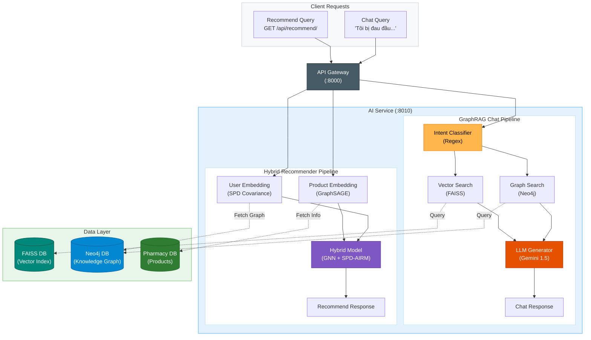

# Hình: ai_architecture
# Kiến trúc AI Service — GraphRAG + GNN/SPD Recommender
# Dán code dưới vào https://mermaid.live để xuất ảnh PNG

```mermaid
%%{init: {"flowchart": {"curve": "linear", "nodeSpacing": 50, "rankSpacing": 50}}}%%
flowchart TD
    subgraph CLIENT ["Client Requests"]
        direction LR
        C_CHAT["Chat Query\n'Tôi bị đau đầu...'"]
        C_REC["Recommend Query\nGET /api/recommend/"]
    end

    GW["API Gateway\n(:8000)"]

    subgraph AI ["AI Service (:8010)"]
        direction LR
        
        subgraph CHAT ["GraphRAG Chat Pipeline"]
            direction TB
            INTENT["Intent Classifier\n(Regex)"]
            NEO_Q["Graph Search\n(Neo4j)"]
            FAISS_Q["Vector Search\n(FAISS)"]
            LLM["LLM Generator\n(Gemini 1.5)"]
            OUT_CHAT["Chat Response"]

            INTENT --> NEO_Q & FAISS_Q
            NEO_Q --> LLM
            FAISS_Q --> LLM
            LLM --> OUT_CHAT
        end

        subgraph REC ["Hybrid Recommender Pipeline"]
            direction TB
            U_EMB["User Embedding\n(SPD Covariance)"]
            P_EMB["Product Embedding\n(GraphSAGE)"]
            HYBRID["Hybrid Model\n(GNN + SPD-AIRM)"]
            OUT_REC["Recommend Response"]

            U_EMB --> HYBRID
            P_EMB --> HYBRID
            HYBRID --> OUT_REC
        end
    end

    subgraph DATA ["Data Layer"]
        direction LR
        FAISS[("FAISS DB\n(Vector Index)")]
        NEO[("Neo4j DB\n(Knowledge Graph)")]
        PHAR[("Pharmacy DB\n(Products)")]
    end

    C_CHAT --> GW
    C_REC --> GW
    
    GW --> INTENT
    GW --> U_EMB
    GW --> P_EMB

    %% Thay đổi mũi tên để ép rank hướng xuống dưới
    FAISS_Q -.->|"Query"| FAISS
    NEO_Q -.->|"Query"| NEO
    U_EMB -.->|"Fetch Graph"| NEO
    P_EMB -.->|"Fetch Info"| PHAR

    %% Ép vị trí các khối con
    CLIENT ~~~ GW
    GW ~~~ CHAT
    GW ~~~ REC
    CHAT ~~~ DATA
    REC ~~~ DATA

    style CLIENT fill:#f8f9fa,stroke:#dee2e6,stroke-width:2px
    style AI fill:#e3f2fd,stroke:#90caf9,stroke-width:2px
    style CHAT fill:#ffffff,stroke:#bbdefb
    style REC fill:#ffffff,stroke:#bbdefb
    style DATA fill:#e8f5e9,stroke:#a5d6a7,stroke-width:2px

    style GW fill:#455a64,color:#fff,stroke:#263238
    style INTENT fill:#ffb74d,color:#000,stroke:#f57c00
    style LLM fill:#e65100,color:#fff,stroke:#bf360c
    style HYBRID fill:#7e57c2,color:#fff,stroke:#512da8
    
    style NEO fill:#0288d1,color:#fff,stroke:#01579b
    style FAISS fill:#00897b,color:#fff,stroke:#004d40
    style PHAR fill:#2e7d32,color:#fff,stroke:#1b5e20
```
